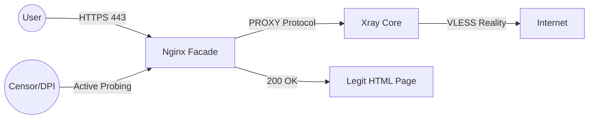
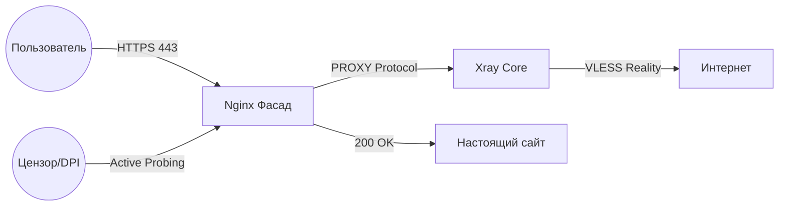

# Obelisk PN — Core Components (Open Source)

[English](#english) | [Русский](#русский)

---

## English

Welcome to the public repository of **Obelisk PN**. 

We believe that a VPN service should be transparent about how it handles user data and how it ensures security. This repository contains the core logic for server deployment and client configuration generation used in our service.

### 🏗️ Architecture Overview

To protect our users from active probing, we use a multi-layer approach:

### ⚔️ Protocol Comparison: Obelisk vs. Legacy

Why don't we rely solely on OpenVPN or WireGuard?

| Feature | OpenVPN / WireGuard | **Obelisk PN (Reality)** |
| :--- | :--- | :--- |
| **Encryption** | Military-grade | Military-grade |
| **Visibility** | High (Easily identified by DPI) | **None (Looks like HTTPS)** |
| **Bypass Blocks** | Limited (Blocked in censored regions) | **Excellent (DPI-resistant)** |
| **Active Probing** | Vulnerable | **Protected (via Nginx Facade)** |

**Note:** While WireGuard is excellent for privacy in free regions, it is easily fingerprinted. Obelisk PN uses **VLESS REALITY** to ensure that your VPN traffic is indistinguishable from visiting a popular website.

### 🔒 Security & Logging Policy

Transparency means being honest about what technical data is generated:

- **Access Logs (`access.log`):** In a default setup, this records your IP address and the domains you visit. **On Obelisk PN production nodes, this is completely disabled (`loglevel: none`)**. We do not store your browsing history.
- **Error Logs (`error.log`):** Contains technical data about connection failures or service status. We use this only for real-time maintenance and never for user tracking.

### 🛡️ Our Philosophy: Transparency vs. Availability

You might notice that this repository doesn't contain 100% of our code. We have made a conscious decision to keep our specific **censorship evasion patterns** private. 

**Why?**
In the current landscape of internet censorship, publishing exact obfuscation signatures or transport-layer patches is equivalent to handing a manual to the censors. Once a specific evasion method becomes public and massive, it is analyzed and blocked by DPI (Deep Packet Inspection) systems within days.

By keeping our evasion layer private, we ensure:
1. **Long-term availability:** Our users stay connected even during massive blocking waves.
2. **Dynamic response:** We can update our methods faster than they can be fingerprinted.

However, we open-source our **Privacy Layer** so you can verify that:
- We don't implement logging.
- We use industry-standard encryption (Xray/VLESS REALITY).
- Our server hardening follows best practices.

### 📂 Repository Structure

#### 1. `setup.sh` (Server Engine)
This script automates the deployment of an Obelisk PN node.
- **BBR Optimization:** Tweaks the Linux kernel for high-speed packet delivery and low latency.
- **Nginx Facade:** Implements a "front" that responds to active probing. If a censor tries to scan the IP, they see a standard Nginx landing page instead of a VPN server.
- **Xray Core:** Installs and configures the industry-standard Xray-core with VLESS REALITY.
- **Hardened Firewall:** Only essential ports (SSH, HTTP, HTTPS) are open to minimize the attack surface.

#### 2. `config_builder.py` (Privacy Logic)
This Python module generates the JSON configurations for our clients.
- **Split Routing:** Automatically routes Russian services (banking, government, local CDN) directly for maximum speed, while routing censored content through the secure tunnel.
- **Split DNS:** Uses encrypted DNS (DoH) to prevent DNS leaking and spoofing.
- **REALITY Integration:** Implements the latest REALITY protocol parameters to mimic standard TLS traffic.

### 🔗 Stay Connected

- **Website:** [obeliskpn.pw on ru](https://obeliskpn.pw)

### 🚀 Why choose Obelisk PN?

At **[obeliskpn.pw](https://obeliskpn.pw)**, we don't just provide a connection; we provide a fortress for your digital life.
- **Strict Zero-Logs Policy:** We never track, collect, or share your private data. Your online activity is your business only.
- **Maximum Security:** By combining REALITY protocols with Nginx facades, we ensure your traffic is indistinguishable from standard web browsing.
- **High Performance:** Optimized kernel parameters and direct routing for local services ensure you get the best possible speed without compromising on privacy.

---

---

## Русский

Добро пожаловать в публичный репозиторий **Obelisk PN**.

Мы убеждены, что VPN-сервис должен быть прозрачным в вопросах обработки пользовательских данных и обеспечения безопасности. В этом репозитории собрана основная логика развертывания серверов и генерации клиентских конфигураций, которые используются в нашем сервисе.

### 🏗️ Обзор архитектуры

Для защиты от активного зондирования (active probing) мы используем многослойный подход:

### ⚔️ Сравнение протоколов: Obelisk против Классики

Почему мы не используем только OpenVPN или WireGuard?

| Характеристика | OpenVPN / WireGuard | **Obelisk PN (Reality)** |
| :--- | :--- | :--- |
| **Шифрование** | Высокое | Высокое |
| **Заметность** | Высокая (Легко выявляется DPI) | **Нулевая (Выглядит как HTTPS)** |
| **Обход блокировок** | Плохо (Блокируется за секунды) | **Отлично (DPI-резистентность)** |
| **Активное зондирование** | Уязвим | **Защищен (через Nginx Фасад)** |

**Примечание:** Хотя WireGuard отлично подходит для обеспечения приватности в свободных сетях, его легко «увидеть» и заблокировать по протоколу. Obelisk PN использует **VLESS REALITY**, чтобы ваш VPN-трафик был неотличим от посещения обычного популярного сайта.

### 🔒 Безопасность и политика логирования

Прозрачность — это честность в том, какие технические данные могут генерироваться системой:

- **Логи доступа (`access.log`):** По умолчанию здесь фиксируются IP-адреса пользователей и посещаемые ими домены. **На боевых узлах Obelisk PN этот лог полностью отключен (`loglevel: none`)**. Мы не храним историю ваших посещений.
- **Логи ошибок (`error.log`):** Содержат техническую информацию о сбоях соединений или статусе сервиса. Мы используем их только для оперативного обслуживания и никогда — для слежки за пользователями.

### 🛡️ Наша философия: Прозрачность против Блокировок

Вы можете заметить, что этот репозиторий не содержит 100% нашего кода. Мы приняли осознанное решение оставить наши специфические **методы обхода цензуры** закрытыми.

**Почему?**
В современных реалиях интернет-цензуры публикация точных сигнатур обфускации или патчей транспортного уровня равносильна передаче инструкции самим цензорам. Как только конкретный метод обхода становится публичным и массовым, системы DPI (Deep Packet Inspection) анализируют и блокируют его в течение нескольких дней.

Сохраняя уровень обхода закрытым, мы гарантируем:
1. **Долгосрочную доступность:** Наши пользователи остаются на связи даже во время массовых волн блокировок.
2. **Динамическую реакцию:** Мы можем обновлять методы обхода быстрее, чем их успевают внести в реестры блокировок.

Тем не менее, мы открываем наш **Уровень Приватности (Privacy Layer)**, чтобы вы могли убедиться:
- Мы не ведем логи.
- Мы используем индустриальные стандарты шифрования (Xray/VLESS REALITY).
- Настройка наших серверов соответствует лучшим практикам безопасности.

### 📂 Структура репозитория

#### 1. `setup.sh` (Серверный движок)
Этот скрипт автоматизирует развертывание узла Obelisk PN.
- **Оптимизация BBR:** Настройка ядра Linux для высокоскоростной передачи пакетов и минимальной задержки.
- **Nginx Фасад:** Реализует «витрину», которая отвечает на активное зондирование. Если цензор попытается просканировать IP, он увидит стандартную страницу Nginx, а не VPN-сервер.
- **Xray Core:** Установка и настройка эталонного ядра Xray с протоколом VLESS REALITY.
- **Защищенный Firewall:** Открыты только необходимые порты (SSH, HTTP, HTTPS), что минимизирует поверхность атаки.

#### 2. `config_builder.py` (Логика приватности)
Python-модуль для генерации JSON-конфигураций наших клиентов.
- **Раздельная маршрутизация (Split Routing):** Автоматически направляет трафик российских сервисов (банки, госуслуги, локальные CDN) напрямую для максимальной скорости, а заблокированный контент — через защищенный туннель.
- **Раздельный DNS:** Использование зашифрованного DNS (DoH) для предотвращения утечек и подмены DNS-запросов.
- **Интеграция REALITY:** Реализация актуальных параметров протокола REALITY для имитации стандартного TLS-трафика.

### 🔗 Связь с нами

- **Сайт:** [obeliskpn.pw](https://obeliskpn.pw)
- **Канал с новостями:** [Obelisk News](https://t.me/obeliskpn)

### 🚀 Почему выбирают Obelisk PN?

На **[obeliskpn.pw](https://obeliskpn.pw)** мы не просто предоставляем доступ в интернет — мы создаем защищенную среду для вашей цифровой жизни.
- **Строгая политика отсутствия логов:** Мы никогда не отслеживаем, не собираем и не передаем ваши личные данные. Ваша активность в сети касается только вас.
- **Максимальная безопасность:** Сочетание протоколов REALITY и фасадов Nginx гарантирует, что ваш трафик неотличим от обычного веб-серфинга.
- **Высокая скорость:** Оптимизированные параметры ядра и прямая маршрутизация для локальных сервисов обеспечивают максимальную скорость без ущерба для приватности.

---
*Obelisk PN — Privacy is not a crime.*
